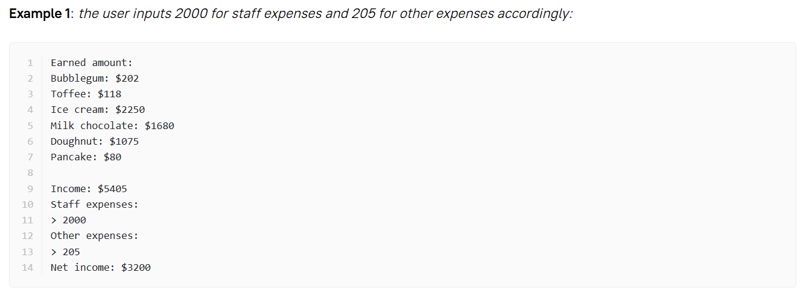

## Corner-Shop-Calculator
Ever dreamed of owning a shop? 

## Overview
This project is about how to calculate your shop's net income using Python.
It is a practical calculator that gives you a clear picture of your shop's financial health.

## How to Use
1. Clone the repository:
git clone  https://github.com/GithubParvana/Corner-Shop-Calculator.git

2. Run the command:
python net_income.py

